# Auto-Detection Flow - Visual Guide

## Complete Request Processing Flow

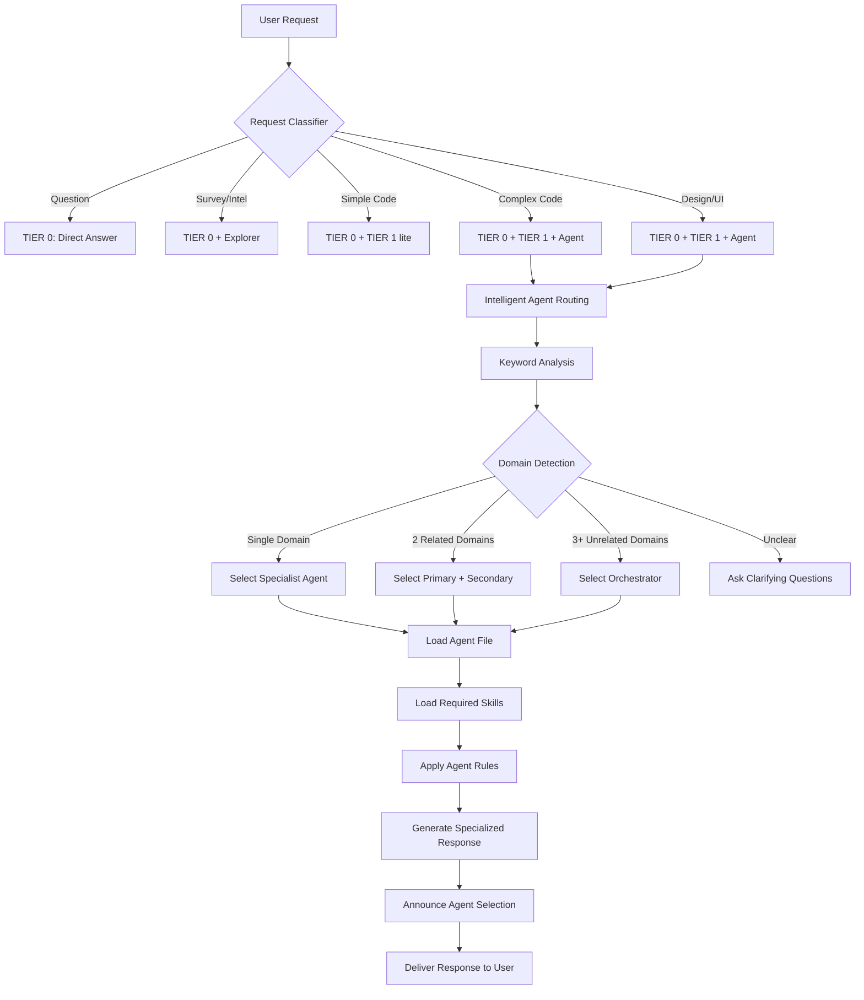

## Keyword Matching Process

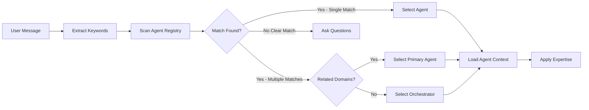

## Agent Selection Decision Tree

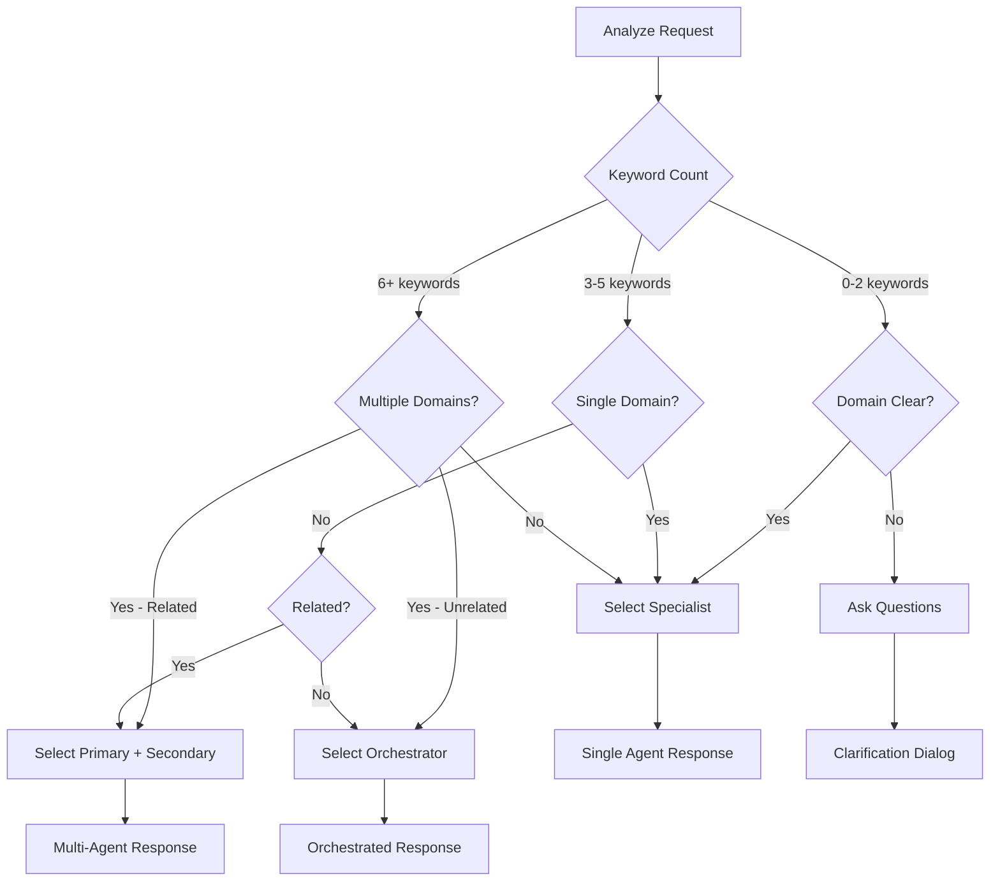

## Example Flows

### Example 1: Simple Frontend Request

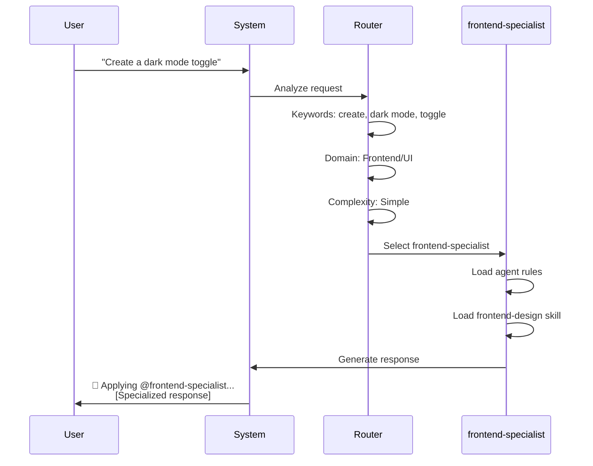

### Example 2: Security + Backend Request

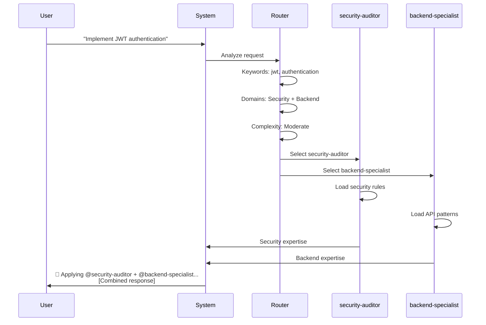

### Example 3: Complex Multi-Domain Request

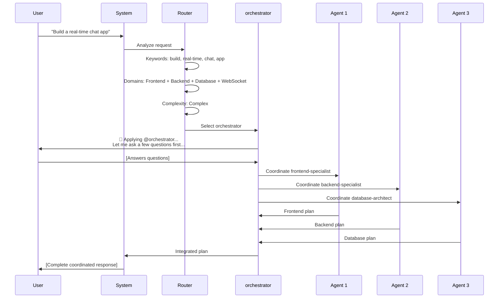

### Example 4: Bug Fix Request

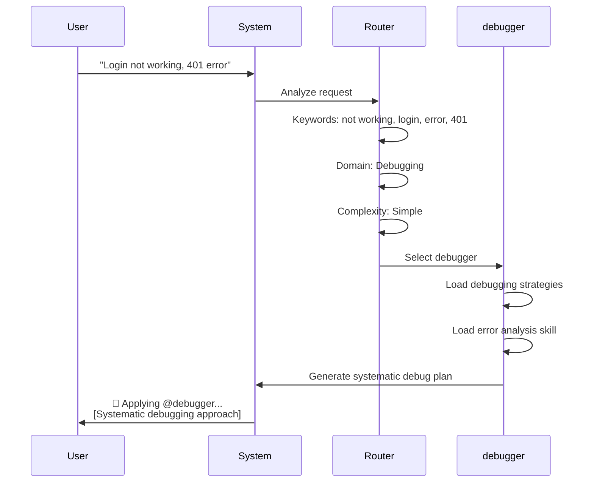

## Priority Rules Flowchart

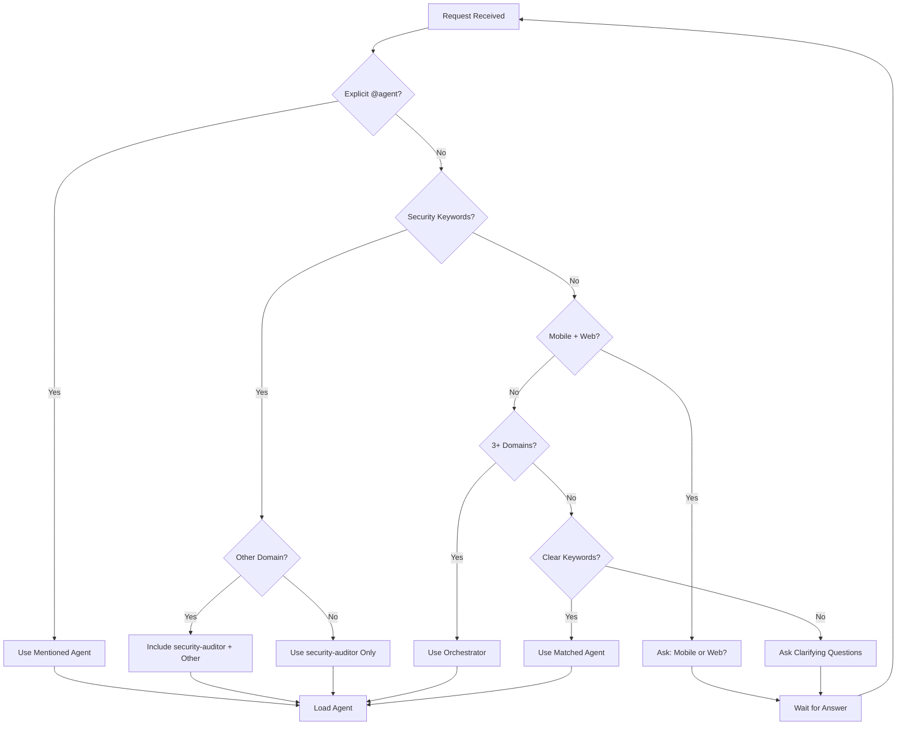

## Confidence Scoring System

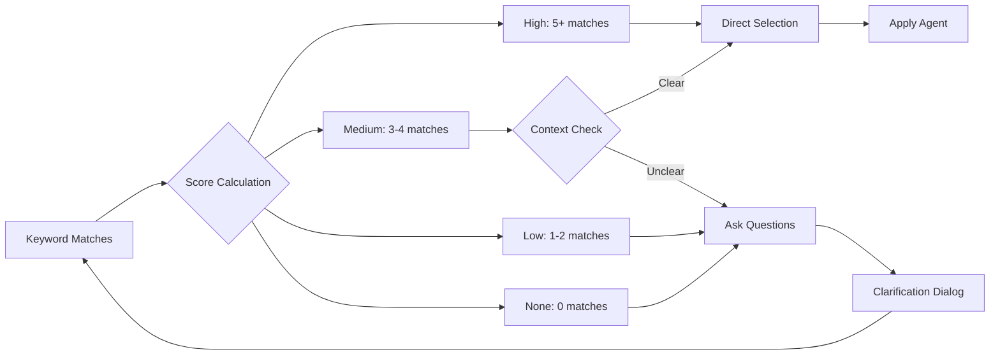

## Multi-Agent Coordination

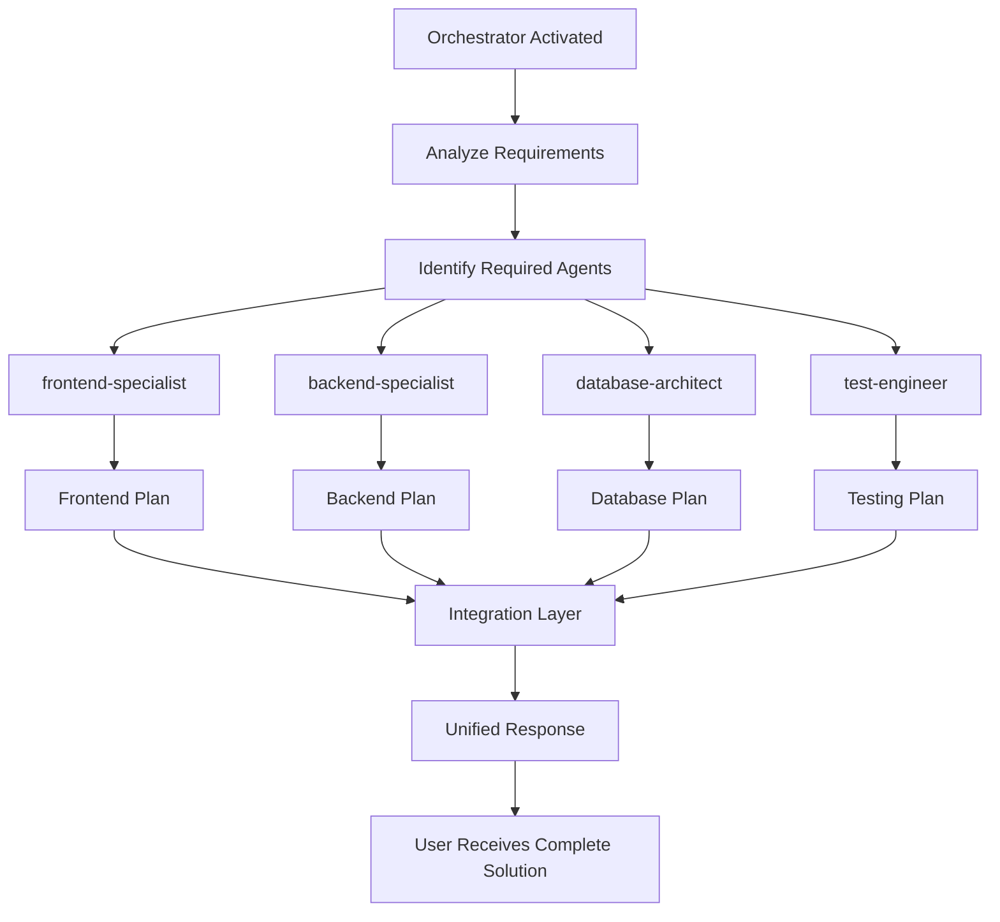

## Error Handling Flow

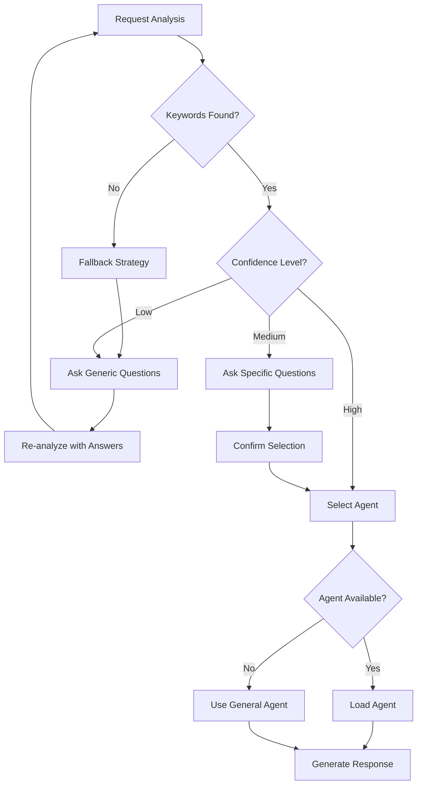

## Performance Optimization

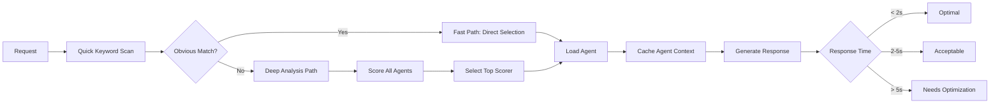

## Integration Points

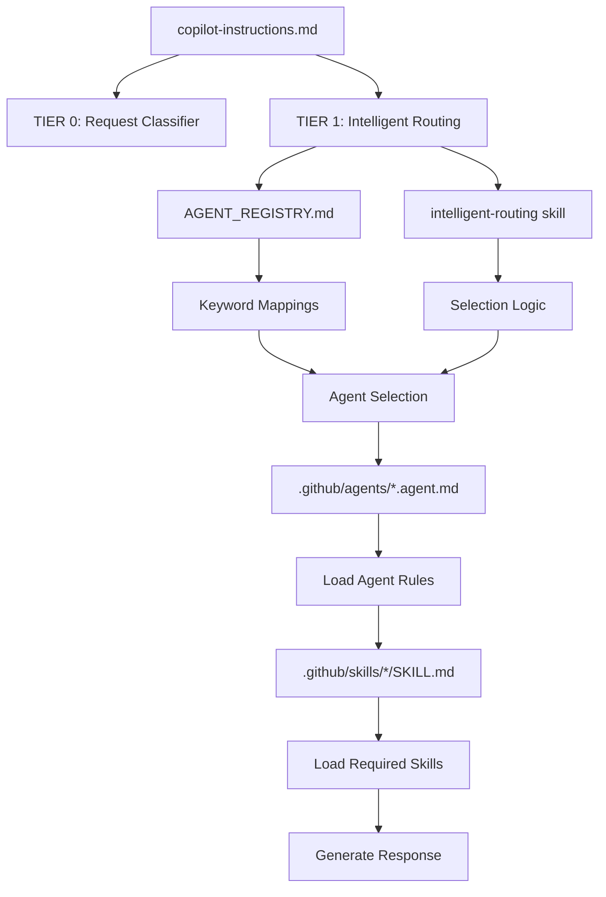

---

## Key Takeaways

1. **Automatic**: No need to mention `@agent-name`
2. **Intelligent**: Analyzes keywords, domains, and complexity
3. **Transparent**: Always announces which agent is being used
4. **Flexible**: Can handle single-domain, multi-domain, and complex tasks
5. **Override-able**: User can still explicitly mention agents
6. **Efficient**: Fast keyword matching with fallback to deep analysis

---

**Reference**: See `.github/AGENT_REGISTRY.md` for complete keyword mappings and `.github/AUTO_DETECTION_GUIDE.md` for usage examples.

**Last Updated**: 2025-02-13
